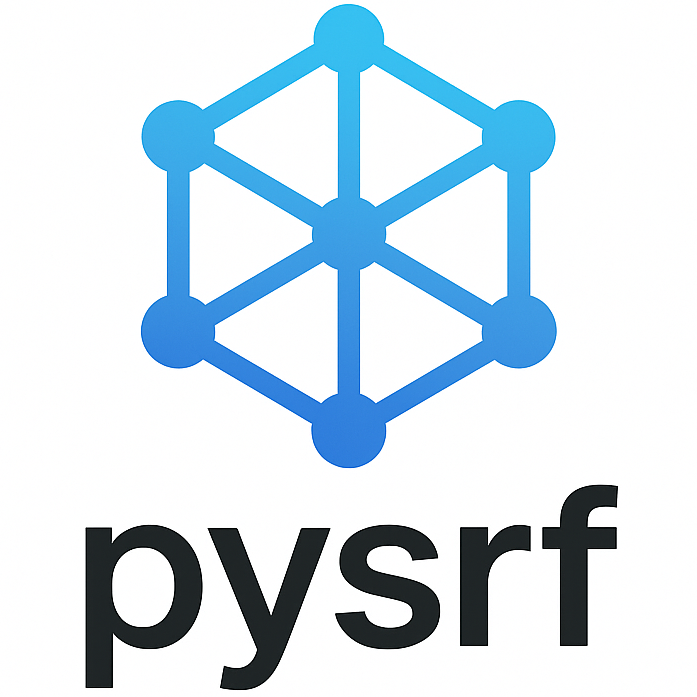

# pysrf

[](https://www.python.org/downloads/)
[](https://opensource.org/licenses/MIT)


Symmetric non-negative matrix factorization using ADMM optimization. Decomposes a
similarity matrix **S** into a low-rank non-negative embedding **W** such that
**S** ≈ **WW**ᵀ. Handles missing data, supports bounded constraints, and
includes rank estimation through cross-validation.

## Installation

```bash
git clone https://github.com/fmahner/pysrf.git
cd pysrf
./setup.sh
```

See the [installation guide](https://fmahner.github.io/pysrf/installation/)
for manual setup, alternative methods, and troubleshooting.

## Quick example

```python
import numpy as np
from pysrf import SRF

s = np.random.rand(100, 100)
s = (s + s.T) / 2

model = SRF(rank=10, max_outer=20, random_state=42)
w = model.fit_transform(s)
s_reconstructed = model.reconstruct()
```

## Documentation

For the full guide, including examples, API reference, cross-validation, and
ensemble clustering, see the [documentation](https://fmahner.github.io/pysrf/).

## License

MIT
