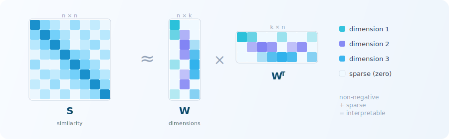

<p align="center">
  
</p>

<p align="center">
  <strong>
    Sparse non-negative factorization of similarity matrices
  </strong>
</p>

<p align="center">
  <a href="https://github.com/florianmahner/pysrf/actions/workflows/ci.yml"></a>
  <a href="https://www.python.org/downloads/"></a>
  <a href="https://opensource.org/licenses/MIT"></a>
  <a href="https://github.com/astral-sh/ruff"></a>
</p>

<p align="center">
  <a href="https://florianmahner.github.io/pysrf/"><strong>Docs</strong></a>
  &middot;
  <a href="https://florianmahner.github.io/pysrf/installation/"><strong>Install</strong></a>
  &middot;
  <a href="https://florianmahner.github.io/pysrf/quickstart/"><strong>Quick start</strong></a>
  &middot;
  <a href="https://florianmahner.github.io/pysrf/examples/"><strong>Examples</strong></a>
  &middot;
  <a href="https://florianmahner.github.io/pysrf/api/model/"><strong>API</strong></a>
</p>

<p align="center">
  Decompose a similarity matrix into sparse, interpretable dimensions:
  <em>S</em> ≈ <em>WW</em><sup>T</sup>.
  Handles missing data, estimates dimensionality via cross-validation, and
  produces stable consensus embeddings.
</p>

<p align="center">
  
</p>

```python
from pysrf import SRF

model = SRF(rank=10, random_state=42)
w = model.fit_transform(s)
```

<p align="center">
  <em>
    Mahner, F. P.*, Lam, K. C.*, & Hebart, M. N. (2025).
    Interpretable dimensions from sparse representational similarities.
    <strong>In preparation</strong>.
  </em>
</p>
