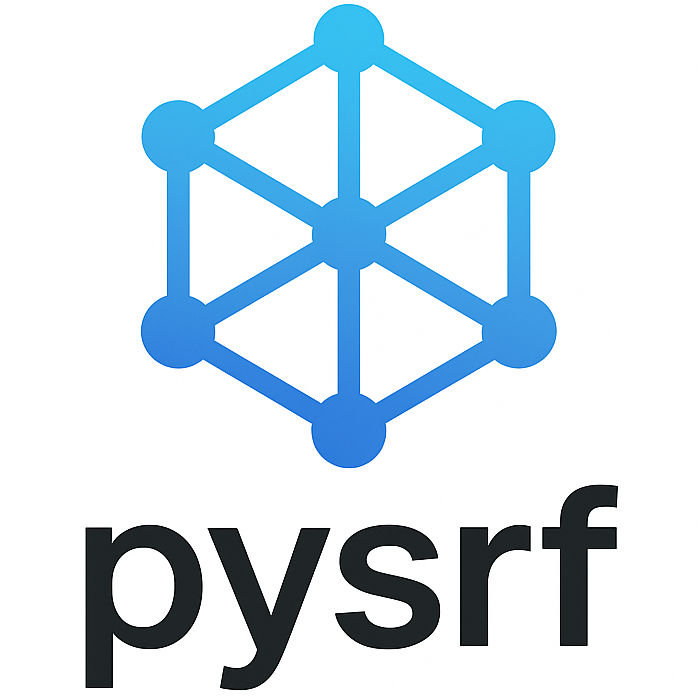
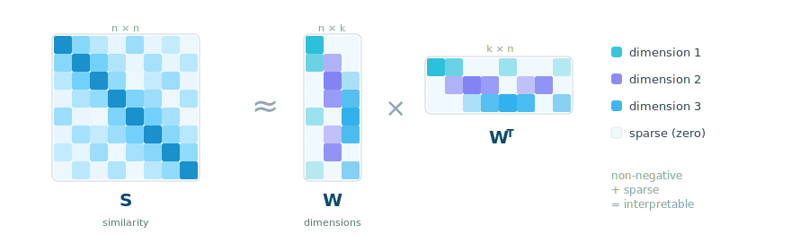

# PySRF

[](https://www.python.org/downloads/)
[](https://opensource.org/licenses/MIT)
[](https://florianmahner.github.io/pysrf/)
[](https://github.com/florianmahner/pysrf/actions/workflows/ci.yml)
[](https://github.com/astral-sh/ruff)

**Discover interpretable dimensions from (sparse) representational similarities.**

PySRF decomposes symmetric similarity matrices into sparse, non-negative
dimensions that capture the latent structure underlying them. It works on
behavioral judgments, neural similarity matrices (fMRI, electrophysiology),
kernel matrices from deep networks, and graph adjacencies.

<p align="center">
  <picture>
    <source media="(prefers-color-scheme: dark)" srcset="assets/factorization-dark.svg">
    
  </picture>
</p>

## Install

```bash
git clone https://github.com/florianmahner/pysrf.git && cd pysrf && ./setup.sh
```

## Quick start

```python
from pysrf import SRF

model = SRF(rank=10, random_state=42)
w = model.fit_transform(s)
```

See **[florianmahner.github.io/pysrf](https://florianmahner.github.io/pysrf/)**
for installation details, walkthroughs, examples, and the API reference.
