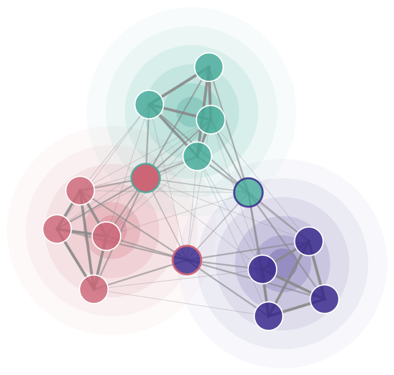

<div align="center">



[](https://www.python.org/downloads/)
[](https://opensource.org/license/bsd-3-clause)
[](https://florianmahner.github.io/pysrf/)
[](https://github.com/florianmahner/pysrf/actions/workflows/ci.yml)
[](https://github.com/astral-sh/ruff)

</div>

PySRF implements Similarity-Based Representation Factorization (SRF): given a symmetric, non-negative similarity matrix `S`, it reveals a small set of sparse, non-negative dimensions `W` with `S ≈ WWᵀ`. It learns from the observed entries only (no imputation) and selects the number of dimensions by cross-validation.

## Install

```bash
git clone https://github.com/florianmahner/pysrf.git && cd pysrf && ./setup.sh
```

## Quick start

```python
from pysrf import SRF

model = SRF(rank=10, random_state=42)
w = model.fit_transform(s)
```

See **[florianmahner.github.io/pysrf](https://florianmahner.github.io/pysrf/)** for installation details, walkthroughs, examples, and the API reference.

## Citation

To cite PySRF, use the **Cite this repository** button in the sidebar (generated from [`CITATION.cff`](CITATION.cff)), or read the preprint at [arXiv:2605.26921](https://arxiv.org/abs/2605.26921).
